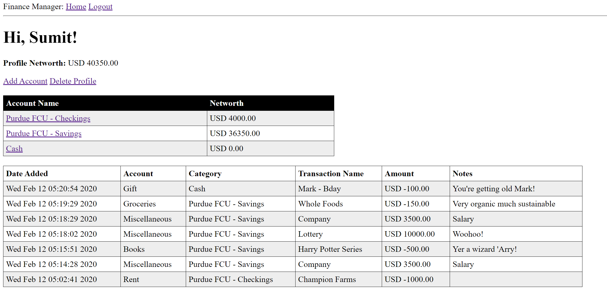
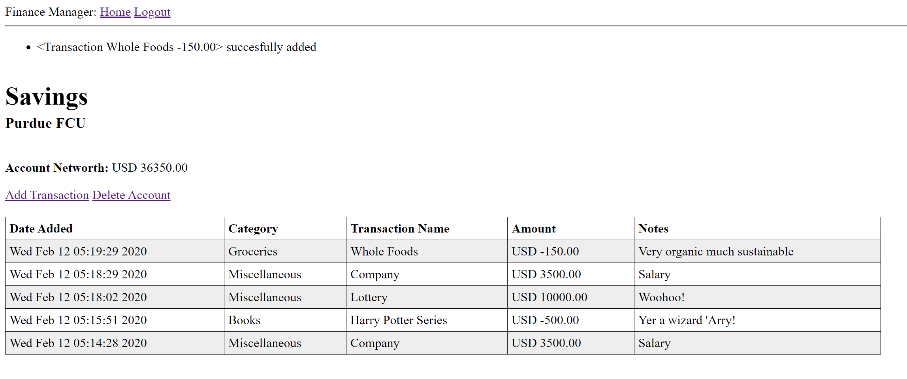
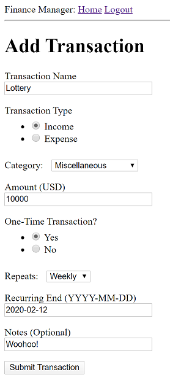
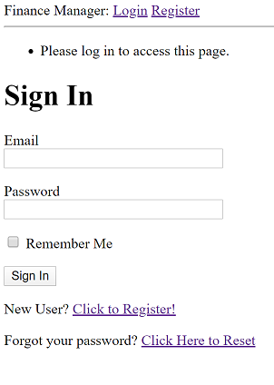
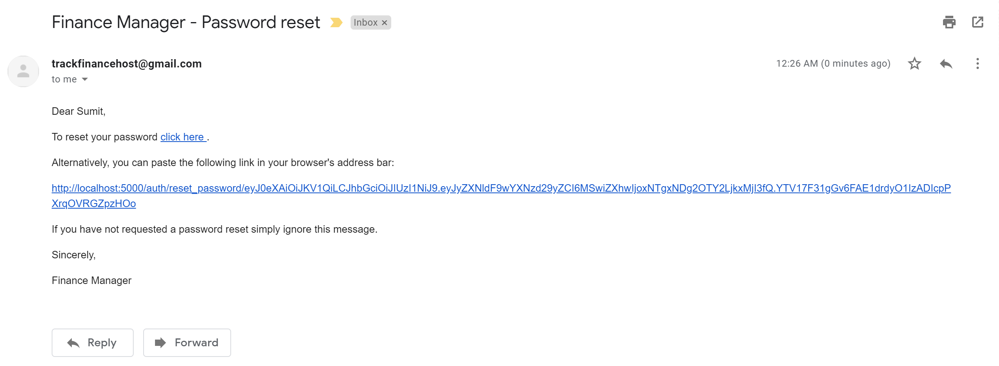

# Finance Manager

This project was created by Sumit Yadav using the `Flask` framework in Python, along with the `SQLAlchemy` Object Relational Mapper. The idea behind the project is to keep better track of my personal spending, while also learning and having fun building a new application.

The application is built from the ground up to be used as a REST API. However currently it makes use of temporary front-end HTML design and forms to assist with development while providing a skeleton structure of what the app might look like.

Here is an example of the user profile page:

## Database Model

The database is comprised of 4 tables - `User`, `Account`, `Transaction` and `Category`. The fields and relationships between them are shown below:

The application was built in an incremental fashion - by adding one table at a time, with various unit tests performed at each step to ensure continued functionality. It makes use of `alembic` database migrations, which provides great support in incrementally building up different models in a database and allowing seamless transitions as the tables get modified.

> Account page:

> Some other pictures:

   

> There is also added email support for password recovery and error logging:

## Future goals

These are some modifications I am currently working on, or plan to work on:

1. Option to link bank accounts and fetch information directly
2. Make a clean RESTful API version of the app, with JSON responses
3. Add a `Javascript` front-end which uses the API
